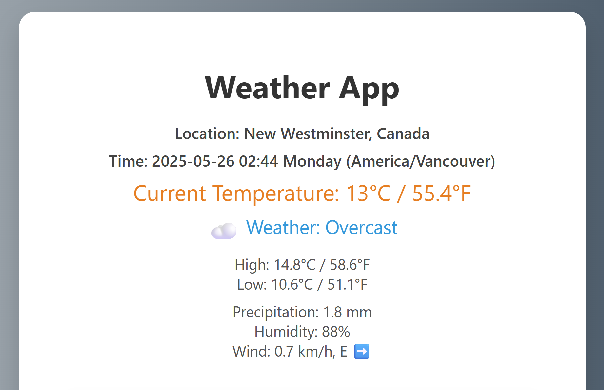
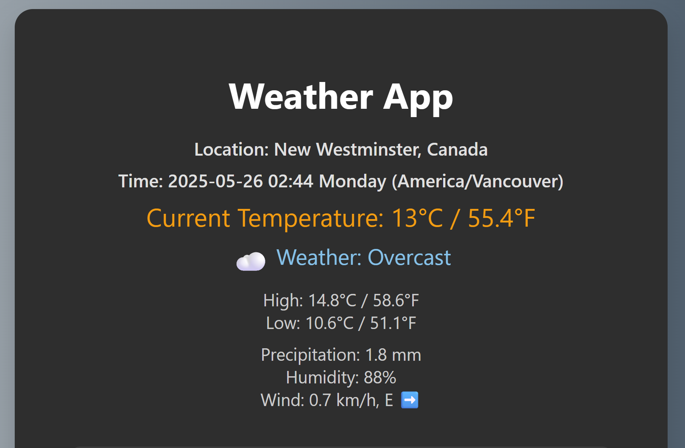

# 🌦️ Weather App

A responsive React web application that shows your current weather based on geolocation.  
Supports dark mode, 7-day forecast, animated icons, and dynamic background gradients based on weather.

---

## 📸 Screenshots

  


---

## 🚀 Features

- 📍 Get weather using browser geolocation  
- 🌓 Light/Dark mode toggle  
- 🧭 Wind speed + direction (with compass arrows)  
- 📅 7-day forecast (with emoji icons + hover effects)  
- 📱 Mobile-friendly & landscape optimized  
- 🎨 Animated icons and dynamic background gradients  

---

## 🛠️ Getting Started

### 1. Clone this repo

```bash
git clone https://github.com/georgelsf/weather-app.git
cd weather-app
```

### 2. Install dependencies

```bash
npm install
```

### 3. Add API Key

Create a `.env` file in the root directory:

```env
REACT_APP_GEOCODE_API_KEY=your_api_key
```

Get a free key from: https://geocode.maps.co

### 4. Start the app

```bash
npm start
```

---

## 🗺️ How It Works

- Uses the browser's **Geolocation API** to get your latitude/longitude.
- Fetches:
  - **Weather data** from [Open-Meteo](https://open-meteo.com)
  - **Location name** using [Geocode Maps API](https://geocode.maps.co)
- Dynamically adjusts layout and color themes based on weather and screen size.

---

## 🧪 Tech Stack

- React (Create React App)  
- HTML5 + CSS3  
- Open-Meteo API  
- Geocode Maps API  
- Responsive Design + Dark Mode  

---

## 📦 Deployment

To deploy this app (e.g. to GitHub Pages or Vercel), just ask and I’ll help you configure it!

---

## 👤 Author

Developed by [georgelsf](https://github.com/georgelsf) 🔧